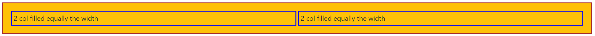

# BOOTSTRAP

------

## What is bootstrap?

1. Front-end framework
2. Includes HTML and CSS based design templates 
3. Provide facility to create  responsive website [good looking website for all kind of devices]

## Bringing Bootstrap in project

1. Include the CDN link directly into the html file [link](https://getbootstrap.com/docs/4.5/getting-started/introduction/) [non angular project]

   ~~~html
   <!--add following in the head section of the html file-->
   <head>
       
   <link rel="stylesheet" 					    				href="https://stackpath.bootstrapcdn.com/bootstrap/4.5.0/css/bootstrap.min.css" integrity="sha384-9aIt2nRpC12Uk9gS9baDl411NQApFmC26EwAOH8WgZl5MYYxFfc+NcPb1dKGj7Sk" crossorigin="anonymous">
   
   </head>
   
   <body>
       
   	<!--add following scripts at the end of the body section-->
   	<script src="https://code.jquery.com/jquery-3.5.1.slim.min.js" 
               integrity="sha384-DfXdz2htPH0lsSSs5nCTpuj/zy4C+OGpamoFVy38MVBnE+IbbVYUew+OrCXaRkfj" 		   crossorigin="anonymous">	
       </script>
   
   	<script src="https://cdn.jsdelivr.net/npm/popper.js@1.16.0/dist/umd/popper.min.js" 			      	integrity="sha384-Q6E9RHvbIyZFJoft+2mJbHaEWldlvI9IOYy5n3zV9zzTtmI3UksdQRVvoxMfooAo" 		        crossorigin="anonymous">
        </script>
   
   	<script src="https://stackpath.bootstrapcdn.com/bootstrap/4.5.0/js/bootstrap.min.js" 	        	integrity="sha384-OgVRvuATP1z7JjHLkuOU7Xw704+h835Lr+6QL9UvYjZE3Ipu6Tp75j7Bh/kR0JKI" 			crossorigin="anonymous">
   	</script>
       
   </body>
   ~~~

2. In angular project

   ~~~shell
   #perform the following command in project directory through powershell
   npm install --save bootstrap@3
   
   # verify the following folder of the project for bootstrap entry
   node_module
   
   # make an entry in the angular.json file of the project directory 
   "build":{
   	"options":{
   		"styles":[node_module/bootstrap/dist/css/bootstrap.min.css]
   	}
   }
   
   # resart the server 
   ng serve # from the project directory
   
   # inspect the element and specificaly style section
   ~~~

Bootstrap Grid System

1. Bootstrap provides 12 columns across the webpage called **SPAN**

2. This number of span in each row should not exceed more than 12

3. Consider the grid as a wire frame on which different element can be place

4. Grid system is responsive, it adjust itself according to the screen size

5. Grid can be enclosed in container

6. Bootstrap grid classes

   1. ```class="col-xs"``` : extra small [for phones]
   2. ```class = "col-sm"``` : small [tablets]
   3. ```class = "col-md"``` : medium [Laptops]
   4. ```class = "col-lg"``` : large [large desktops]
   5. ```col``` stands for columns

   ~~~html
   <!--Defining the html div as a column with above mentioned class -->
   <div class="col-sm-4">column small 4 spans</div>
   <div class="col-xs-6">column extra small 6 span</div>
   <div class="col-md-2">column medium 2 spans</div>
   <div class="col-lg-1">column large 1 span</div>
   ~~~

7. Defining the grid system 

   ~~~html
   <div class="row">  <!--create the columns in row div-->
       <div class="col-md-4"></div>
       <div class="col-md-4"></div>
       <div class="col-md-4"></div>
       <!--Total of spans in one row div must be 4+4+4=12-->
   </div>
   ~~~

8. Grid Template

   ~~~html
   <!--HTML file-->
   <div class="container containerClass">
   	<div class="row rowClass">
                   <div class="col-md-2 columnClass">span 1+2</div>
                   <div class="col-md-2 columnClass">span 3+4</div>
                   <div class="col-md-2 columnClass">span 5+6</div>
                   <div class="col-md-2 columnClass">span 7+8</div>
                   <div class="col-md-2 columnClass">span 9+10</div>
                   <div class="col-md-2 columnClass">span 11+12</div>
      </div>
       
      <div class="row rowClass">
          		    <!--different grouping of the columns-->
                   <div class ="col-md-3 columnClass">3 spans</div>
                   <div class ="col-md-6 columnClass">6 spans</div>
                   <div class = "col-md-3 columnClass">3 spans</div>
      </div>   
   </div>
   ~~~

   ~~~css
   /*css classes*/ 
   .containerClass{
        border: steelblue 5px solid;
        padding: 20px;
    }   
   
    .rowClass{
        border: rgb(235, 115, 17) 5px solid;
        padding: 5px;
        margin: 3px;
    }
   
    .columnClass{
       border: rgb(45, 179, 105) 2px solid;
       background-color: yellowgreen;
       padding: 5px;
       padding-bottom: 7px;
    }
   ~~~

   Output:

   

9. Nesting of row inside column and vice-versa is possible

   ~~~html
           <div class="container containerClass">
               <div class="row rowClass">
   
                   <div class="col-md columnClass">
                       <div class="row rowClass">
                           <div class="col-md columnClass" align="center">baby column1</div>
                           <div class="col-md columnClass" align="center">baby column2</div>
                           <div class="col-md columnClass" align="center">baby column3</div>
                       </div>
                       <div class="row rowClass">
                           <div class="col-md columnClass" align="center">baby column4</div>
                           <div class="col-md columnClass" align="center">baby column5</div>
                           <div class="col-md columnClass" align="center">baby column6</div>
                           <div class="col-md columnClass" align="center">baby column7</div>
                       </div>
                   </div>
   
   
                   <div class="col-md columnClass">
                       <div class="row rowClass">
                           <div class="col-md columnClass" align="center">baby column</div>
                           <div class="col-md columnClass" align="center">baby column</div>
                           <div class="col-md columnClass" align="center">baby column</div>
                           <div class="col-md columnClass" align="center">baby column</div>
                       </div>
                       <div class="row rowClass">
                           <div class="col-md columnClass" align="center">baby column</div>
                           <div class="col-md columnClass" align="center">baby column</div>
                           <div class="col-md columnClass" align="center">baby column</div>
                       </div>
                       <div class="row rowClass">
                           <div class="col-md columnClass" align="center">baby column</div>
                           <div class="col-md columnClass" align="center">baby column</div>
                       </div>
                   </div>
               </div>
           </div>
   ~~~

   

10. different sizes of the grid

    ~~~html
    <div class="container containerClass">
                <div class="row rowClass">
                    <div class="col-md-3 columnClass">3spans</div>
                    <div class="col-md-9 columnClass">9spans</div>
                </div>
                <div class="row rowClass">
                    <div class="col-md-4 columnClass">4span</div>
                    <div class="col-md-4 columnClass">4span</div>
                    <div class="col-md-4 columnClass">4span</div>
                </div>
                <div class="row rowClass">
                    <div class="col-md-4 columnClass">4span</div>
                    <div class="col-md-2 columnClass">2span</div>
                </div>
            </div>
    ~~~

    Output:

    

11. Offset in column position

    ~~~html
            <div class="container containerClass">
                <div class="row rowClass" >
                    <div class="col-md-4 offset-md-0 columnClass">column with 0 offset</div>
                </div>
                <div class="row rowClass" >
                    <div class="col-md-4 offset-md-2 columnClass">column with 2 offset</div>
                </div>
                <div class="row rowClass" >
                    <div class="col-md-4 offset-md-5 columnClass">column with 5 offset</div>
                </div>
                <div class="row rowClass" >
                    <div class="col-md-2 offset-md-0 columnClass">column with 0 offset</div>
                    <div class="col-md-2 offset-md-8 columnClass">column with 8 offset</div>
                </div>
            </div>
    ~~~

    


## Flex Box

1. Big flex box

   ~~~html
   <div class="d-flex p-3 bg-secondary">
        <div class="p-5">flex-box with p-5</div>
        <div class="p-5">flex item with p-5</div>
        <div class="p-5">biggest height of flex box</div>
   </div>
   ~~~

   

2. Smaller Flex

   ~~~html
   <div class="d-flex p-2 bg-warning">
        <div class="p-1">flex box with p-2</div>
        <div class="p-1">flex item with p-2</div>
        <div class="p-1">smalle flex-box</div>
   </div>
   ~~~

   

3. Justifying flex content to the beginning

   ~~~html
   <div class="d-flex p-3 bg-info justify-content-start">
          <div class="p-1 ">start justification</div>
   </div>
   ~~~

   

4. Justifying flex content to the center

   ~~~html
   <div class="d-flex p-3 bg-info justify-content-center">
         <div class="p-1 ">middle justification</div>
   </div>
   ~~~

   

5. End Justification

   ~~~html
   <div class="d-flex p-3 bg-info justify-content-end">
        <div class="p-1 ">end justification</div>
   </div>
   ~~~

   

6. Flex-fill [fill the column along the width of flex box]

   ~~~html
   <div class="d-flex p-3 bg-warning">
   	<div class="p-1 flex-fill">1 col filled equally the width</div>
   </div>
   ~~~

   

7. Equal fill the flex box

   ~~~html
   <div class="d-flex p-3 bg-warning" style="border: brown solid; margin: 10px;">
       <div class="p-1 flex-fill">2 col filled equally the width</div>
       <div class="p-1 flex-fill">2 col filled equally the width</div>
   </div>
   ~~~

   

8. Shrinking and growing the flex

   ~~~html
   <div class="d-flex p-3 bg-info">
        <div class="p-1 flex-shrink-1">shrinked</div>
        <div class="p-1 flex-grow-1">grown</div>
   </div>
   ~~~

   

9. flex with margin right 

   ~~~html
   <div class="d-flex p-3 bg-info">
        <div class="p-1 mr-auto">normal flex</div>
        <div class="p-1">Margin righted flex</div>
        <div class="p-1">Margin righted flex</div>
   </div>
   ~~~

   

10. Flex margin left

    ~~~html
    <div class="d-flex p-3 bg-info">
         <div class="p-1">normal flex</div>
         <div class="p-1">normal flex</div>
         <div class="p-1 ml-auto">Margin lefted flex</div>
    </div>
    ~~~

    

## NavBar

1. Simple Nav menu

   ~~~html
   <ul class="nav">	<!--nav menu holded by unordered list-->
               <li class="nav-item">
                   <a class="nav-link" href="#">link1</a>
               </li>
   
               <li class="nav-item">
                   <a class="nav-link" href="#">link2</a>
               </li>
   
               <li class="nav-item">
                   <a class="nav-link" href="#">link3</a>
               </li>
   
               <li class="nav-item">
                   <a class="nav-link disabled" href="#">Disabled</a>
               </li>
   </ul>
   ~~~

   

2. Various alignment

   ~~~html
   <ul class="nav justify-content-start">
               <li class="nav-item">
                   <a class="nav-link" href="#">item1</a>
               </li>
               <li class="nav-item">
                   <a class="nav-link" href="#">item1</a>
               </li>
               <li class="nav-item">
                   <a class="nav-link" href="#">item1</a>
               </li>
   </ul>
           
   <ul class="nav justify-content-center">
               <li class="nav-item">
                   <a class="nav-link" href="#">item1</a>
               </li>
               <li class="nav-item">
                   <a class="nav-link" href="#">item1</a>
               </li>
               <li class="nav-item">
                   <a class="nav-link" href="#">item1</a>
               </li>
   </ul>
   
   <ul class="nav justify-content-end">
               <li class="nav-item">
                   <a class="nav-link" href="#">item1</a>
               </li>
               <li class="nav-item">
                   <a class="nav-link" href="#">item1</a>
               </li>
               <li class="nav-item">
                   <a class="nav-link" href="#">item1</a>
               </li>
   </ul>
   ~~~

   

3. Vertical alignment of nav menu

   ~~~html
   <ul class="nav flex-column">
           <li class="nav-item">
                   <a class="nav-link" href="#">item1</a>
           </li>
           <li class="nav-item">
                   <a class="nav-link" href="#">item1</a>
           </li>
           <li class="nav-item">
                   <a class="nav-link" href="#">item1</a>
           </li>
   </ul>
   ~~~

   

4. also Include the tabs and pills type of nav bar

5. dropdown in menu item

   ~~~html
   <ul class="nav nav-tabs" style="border: crimson solid 3px;  margin-bottom: 5px;">
          <li class="nav-item">
              <a class="nav-link active" href="#">Active</a>
          </li>
       
          <li class="nav-item dropdown"> <!--one of the list item has drop down-->
                 <a class="nav-link dropdown-toggle" data-toggle="dropdown" href="#">Dropdown</a>
                 <div class="dropdown-menu">
                   <a class="dropdown-item" href="#">Link 1</a>
                   <a class="dropdown-item" href="#">Link 2</a>
                   <a class="dropdown-item" href="#">Link 3</a>
                 </div>
          </li>
       
           <li class="nav-item">
                 <a class="nav-link" href="#">Link</a>
           </li>
       
            <li class="nav-item">
                 <a class="nav-link disabled" href="#">Disabled</a>
            </li>
   </ul>
   ~~~

   

6. A standard navigation bar is created with the `.navbar` class, followed by a responsive collapsing class: `.navbar-expand-xl|lg|md|sm` (stacks the navbar vertically on extra large, large, medium or small screens).

7. https://www.w3schools.com/bootstrap4/bootstrap_navbar.asphttps://www.w3schools.com/bootstrap4/bootstrap_navbar.asp

8. 

9. s

10. s

11. s

12. s

