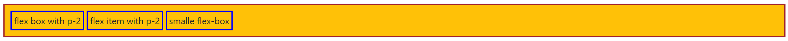
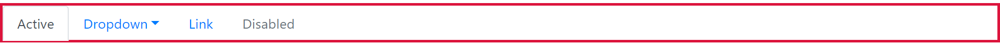
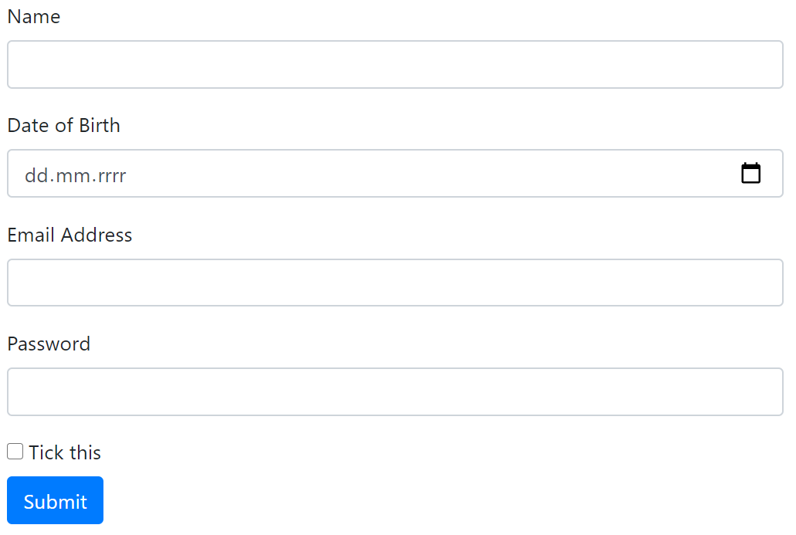

# BOOTSTRAP

------

## What is bootstrap?

1. Front-end framework
2. Includes HTML and CSS based design templates 
3. Provide facility to create  responsive website [good looking website for all kind of devices]

## Bringing Bootstrap in project

1. Include the CDN link directly into the html file [link](https://getbootstrap.com/docs/4.5/getting-started/introduction/) [non angular project]

   ~~~html
   <!--add following in the head section of the html file-->
   <head>
       
   <link rel="stylesheet" 					    				href="https://stackpath.bootstrapcdn.com/bootstrap/4.5.0/css/bootstrap.min.css" integrity="sha384-9aIt2nRpC12Uk9gS9baDl411NQApFmC26EwAOH8WgZl5MYYxFfc+NcPb1dKGj7Sk" crossorigin="anonymous">
   
   </head>
   
   <body>
       
   	<!--add following scripts at the end of the body section-->
   	<script src="https://code.jquery.com/jquery-3.5.1.slim.min.js" 
               integrity="sha384-DfXdz2htPH0lsSSs5nCTpuj/zy4C+OGpamoFVy38MVBnE+IbbVYUew+OrCXaRkfj" 		   crossorigin="anonymous">	
       </script>
   
   	<script src="https://cdn.jsdelivr.net/npm/popper.js@1.16.0/dist/umd/popper.min.js" 			      	integrity="sha384-Q6E9RHvbIyZFJoft+2mJbHaEWldlvI9IOYy5n3zV9zzTtmI3UksdQRVvoxMfooAo" 		        crossorigin="anonymous">
        </script>
   
   	<script src="https://stackpath.bootstrapcdn.com/bootstrap/4.5.0/js/bootstrap.min.js" 	        	integrity="sha384-OgVRvuATP1z7JjHLkuOU7Xw704+h835Lr+6QL9UvYjZE3Ipu6Tp75j7Bh/kR0JKI" 			crossorigin="anonymous">
   	</script>
       
   </body>
   ~~~

2. In angular project

   ~~~shell
   #perform the following command in project directory through powershell
   npm install --save bootstrap@3
   
   # verify the following folder of the project for bootstrap entry
   node_module
   
   # make an entry in the angular.json file of the project directory 
   "build":{
   	"options":{
   		"styles":[node_module/bootstrap/dist/css/bootstrap.min.css]
   	}
   }
   
   # resart the server 
   ng serve # from the project directory
   
   # inspect the element and specificaly style section
   ~~~

Bootstrap Grid System

1. Bootstrap provides 12 columns across the webpage called **SPAN**

2. This number of span in each row should not exceed more than 12

3. Consider the grid as a wire frame on which different element can be place

4. Grid system is responsive, it adjust itself according to the screen size

5. Grid can be enclosed in container

6. Bootstrap grid classes

   1. ```class="col-xs"``` : extra small [for phones]
   2. ```class = "col-sm"``` : small [tablets]
   3. ```class = "col-md"``` : medium [Laptops]
   4. ```class = "col-lg"``` : large [large desktops]
   5. ```col``` stands for columns

   ~~~html
   <!--Defining the html div as a column with above mentioned class -->
   <div class="col-sm-4">column small 4 spans</div>
   <div class="col-xs-6">column extra small 6 span</div>
   <div class="col-md-2">column medium 2 spans</div>
   <div class="col-lg-1">column large 1 span</div>
   ~~~

7. Defining the grid system 

   ~~~html
   <div class="row">  <!--create the columns in row div-->
       <div class="col-md-4"></div>
       <div class="col-md-4"></div>
       <div class="col-md-4"></div>
       <!--Total of spans in one row div must be 4+4+4=12-->
   </div>
   ~~~

8. Grid Template

   ~~~html
   <!--HTML file-->
   <div class="container containerClass">
   	<div class="row rowClass">
                   <div class="col-md-2 columnClass">span 1+2</div>
                   <div class="col-md-2 columnClass">span 3+4</div>
                   <div class="col-md-2 columnClass">span 5+6</div>
                   <div class="col-md-2 columnClass">span 7+8</div>
                   <div class="col-md-2 columnClass">span 9+10</div>
                   <div class="col-md-2 columnClass">span 11+12</div>
      </div>
       
      <div class="row rowClass">
          		    <!--different grouping of the columns-->
                   <div class ="col-md-3 columnClass">3 spans</div>
                   <div class ="col-md-6 columnClass">6 spans</div>
                   <div class = "col-md-3 columnClass">3 spans</div>
      </div>   
   </div>
   ~~~

   ~~~css
   /*css classes*/ 
   .containerClass{
        border: steelblue 5px solid;
        padding: 20px;
    }   
   
    .rowClass{
        border: rgb(235, 115, 17) 5px solid;
        padding: 5px;
        margin: 3px;
    }
   
    .columnClass{
       border: rgb(45, 179, 105) 2px solid;
       background-color: yellowgreen;
       padding: 5px;
       padding-bottom: 7px;
    }
   ~~~

   Output:

   

9. Nesting of row inside column and vice-versa is possible

   ~~~html
           <div class="container containerClass">
               <div class="row rowClass">
   
                   <div class="col-md columnClass">
                       <div class="row rowClass">
                           <div class="col-md columnClass" align="center">baby column1</div>
                           <div class="col-md columnClass" align="center">baby column2</div>
                           <div class="col-md columnClass" align="center">baby column3</div>
                       </div>
                       <div class="row rowClass">
                           <div class="col-md columnClass" align="center">baby column4</div>
                           <div class="col-md columnClass" align="center">baby column5</div>
                           <div class="col-md columnClass" align="center">baby column6</div>
                           <div class="col-md columnClass" align="center">baby column7</div>
                       </div>
                   </div>
   
   
                   <div class="col-md columnClass">
                       <div class="row rowClass">
                           <div class="col-md columnClass" align="center">baby column</div>
                           <div class="col-md columnClass" align="center">baby column</div>
                           <div class="col-md columnClass" align="center">baby column</div>
                           <div class="col-md columnClass" align="center">baby column</div>
                       </div>
                       <div class="row rowClass">
                           <div class="col-md columnClass" align="center">baby column</div>
                           <div class="col-md columnClass" align="center">baby column</div>
                           <div class="col-md columnClass" align="center">baby column</div>
                       </div>
                       <div class="row rowClass">
                           <div class="col-md columnClass" align="center">baby column</div>
                           <div class="col-md columnClass" align="center">baby column</div>
                       </div>
                   </div>
               </div>
           </div>
   ~~~

   

10. different sizes of the grid

    ~~~html
    <div class="container containerClass">
                <div class="row rowClass">
                    <div class="col-md-3 columnClass">3spans</div>
                    <div class="col-md-9 columnClass">9spans</div>
                </div>
                <div class="row rowClass">
                    <div class="col-md-4 columnClass">4span</div>
                    <div class="col-md-4 columnClass">4span</div>
                    <div class="col-md-4 columnClass">4span</div>
                </div>
                <div class="row rowClass">
                    <div class="col-md-4 columnClass">4span</div>
                    <div class="col-md-2 columnClass">2span</div>
                </div>
            </div>
    ~~~

    Output:

    

11. Offset in column position

    ~~~html
            <div class="container containerClass">
                <div class="row rowClass" >
                    <div class="col-md-4 offset-md-0 columnClass">column with 0 offset</div>
                </div>
                <div class="row rowClass" >
                    <div class="col-md-4 offset-md-2 columnClass">column with 2 offset</div>
                </div>
                <div class="row rowClass" >
                    <div class="col-md-4 offset-md-5 columnClass">column with 5 offset</div>
                </div>
                <div class="row rowClass" >
                    <div class="col-md-2 offset-md-0 columnClass">column with 0 offset</div>
                    <div class="col-md-2 offset-md-8 columnClass">column with 8 offset</div>
                </div>
            </div>
    ~~~

    


## Flex Box

1. Big flex box

   ~~~html
   <div class="d-flex p-3 bg-secondary">
        <div class="p-5">flex-box with p-5</div>
        <div class="p-5">flex item with p-5</div>
        <div class="p-5">biggest height of flex box</div>
   </div>
   ~~~

   

2. Smaller Flex

   ~~~html
   <div class="d-flex p-2 bg-warning">
        <div class="p-1">flex box with p-2</div>
        <div class="p-1">flex item with p-2</div>
        <div class="p-1">smalle flex-box</div>
   </div>
   ~~~

   

3. Justifying flex content to the beginning

   ~~~html
   <div class="d-flex p-3 bg-info justify-content-start">
          <div class="p-1 ">start justification</div>
   </div>
   ~~~

   

4. Justifying flex content to the center

   ~~~html
   <div class="d-flex p-3 bg-info justify-content-center">
         <div class="p-1 ">middle justification</div>
   </div>
   ~~~

   

5. End Justification

   ~~~html
   <div class="d-flex p-3 bg-info justify-content-end">
        <div class="p-1 ">end justification</div>
   </div>
   ~~~

   

6. Flex-fill [fill the column along the width of flex box]

   ~~~html
   <div class="d-flex p-3 bg-warning">
   	<div class="p-1 flex-fill">1 col filled equally the width</div>
   </div>
   ~~~

   

7. Equal fill the flex box

   ~~~html
   <div class="d-flex p-3 bg-warning" style="border: brown solid; margin: 10px;">
       <div class="p-1 flex-fill">2 col filled equally the width</div>
       <div class="p-1 flex-fill">2 col filled equally the width</div>
   </div>
   ~~~

   

8. Shrinking and growing the flex

   ~~~html
   <div class="d-flex p-3 bg-info">
        <div class="p-1 flex-shrink-1">shrinked</div>
        <div class="p-1 flex-grow-1">grown</div>
   </div>
   ~~~

   

9. flex with margin right 

   ~~~html
   <div class="d-flex p-3 bg-info">
        <div class="p-1 mr-auto">normal flex</div>
        <div class="p-1">Margin righted flex</div>
        <div class="p-1">Margin righted flex</div>
   </div>
   ~~~

   

10. Flex margin left

    ~~~html
    <div class="d-flex p-3 bg-info">
         <div class="p-1">normal flex</div>
         <div class="p-1">normal flex</div>
         <div class="p-1 ml-auto">Margin lefted flex</div>
    </div>
    ~~~

    

## NavBar

1. Simple Nav menu

   ~~~html
   <ul class="nav">	<!--nav menu holded by unordered list-->
               <li class="nav-item">
                   <a class="nav-link" href="#">link1</a>
               </li>
   
               <li class="nav-item">
                   <a class="nav-link" href="#">link2</a>
               </li>
   
               <li class="nav-item">
                   <a class="nav-link" href="#">link3</a>
               </li>
   
               <li class="nav-item">
                   <a class="nav-link disabled" href="#">Disabled</a>
               </li>
   </ul>
   ~~~

   

2. Various alignment

   ~~~html
   <ul class="nav justify-content-start">
               <li class="nav-item">
                   <a class="nav-link" href="#">item1</a>
               </li>
               <li class="nav-item">
                   <a class="nav-link" href="#">item1</a>
               </li>
               <li class="nav-item">
                   <a class="nav-link" href="#">item1</a>
               </li>
   </ul>
           
   <ul class="nav justify-content-center">
               <li class="nav-item">
                   <a class="nav-link" href="#">item1</a>
               </li>
               <li class="nav-item">
                   <a class="nav-link" href="#">item1</a>
               </li>
               <li class="nav-item">
                   <a class="nav-link" href="#">item1</a>
               </li>
   </ul>
   
   <ul class="nav justify-content-end">
               <li class="nav-item">
                   <a class="nav-link" href="#">item1</a>
               </li>
               <li class="nav-item">
                   <a class="nav-link" href="#">item1</a>
               </li>
               <li class="nav-item">
                   <a class="nav-link" href="#">item1</a>
               </li>
   </ul>
   ~~~

   

3. Vertical alignment of nav menu

   ~~~html
   <ul class="nav flex-column">
           <li class="nav-item">
                   <a class="nav-link" href="#">item1</a>
           </li>
           <li class="nav-item">
                   <a class="nav-link" href="#">item1</a>
           </li>
           <li class="nav-item">
                   <a class="nav-link" href="#">item1</a>
           </li>
   </ul>
   ~~~

   

4. also Include the tabs and pills type of nav bar

5. dropdown in menu item

   ~~~html
   <ul class="nav nav-tabs" style="border: crimson solid 3px;  margin-bottom: 5px;">
          <li class="nav-item">
              <a class="nav-link active" href="#">Active</a>
          </li>
       
          <li class="nav-item dropdown"> <!--one of the list item has drop down-->
                 <a class="nav-link dropdown-toggle" data-toggle="dropdown" href="#">Dropdown</a>
                 <div class="dropdown-menu">
                   <a class="dropdown-item" href="#">Link 1</a>
                   <a class="dropdown-item" href="#">Link 2</a>
                   <a class="dropdown-item" href="#">Link 3</a>
                 </div>
          </li>
       
           <li class="nav-item">
                 <a class="nav-link" href="#">Link</a>
           </li>
       
            <li class="nav-item">
                 <a class="nav-link disabled" href="#">Disabled</a>
            </li>
   </ul>
   ~~~

   

6. A standard navigation bar is created with the `.navbar` class, followed by a responsive collapsing class: `.navbar-expand-xl|lg|md|sm` (stacks the navbar vertically on extra large, large, medium or small screens).

7. https://www.w3schools.com/bootstrap4/bootstrap_navbar.asphttps://www.w3schools.com/bootstrap4/bootstrap_navbar.asp

## Forms

1. 3 types of form Vertical, horizontal, Inline

2. General syntax of label and entry in form

   ~~~html
   <div class="form-group">
        <label for="email">Email Address</label>
        <input class="form-control" id="email" type="email">
   </div>
   ~~~

3. Sample vertical form

   ~~~html
   <div class="form-group">
           <label for = "Nam">Name</label>
           <input class="form-control" id="Nam" type="data">
   </div>
   
    <div class="form-group">
         <label for = "bd">Date of Birth</label>
         <input class="form-control" id="bd" type="date">
    </div>
   
    <div class="form-group">
         <label for="email">Email Address</label>
         <input class="form-control" id="email" type="email">
   </div>
   
   <div class="form-group">
        <label for ="pwd">Password</label>
        <input class="form-control" id="pwd" type="password">
   </div>
   
   <div class="checkbox">
        <label for="tick"> <input id="tick" type="checkbox"> Tick this</label>
   </div>
   
   <button type="submit" class="btn btn-primary" id="submit">Submit</button>
   ~~~

   

## Alerts

1. sample alerts

   ~~~html
   <div class="container" style="margin: 20px;">
   	<div class="alert alert-success">
        	<strong>Success!</strong> Indicates a successful or positive action.
   	</div>
   	<div class="alert alert-info">
        	<strong>Info!</strong> Indicates a neutral informative change or action.
   	</div>   
    	<div class="alert alert-warning">
            <strong>Warning!</strong> Indicates a warning that might need attention.
       </div>    
       <div class="alert alert-danger">
            <strong>Danger!</strong> Indicates a dangerous or potentially negative action.
       </div>
   </div> 
   ~~~

   

2. Alert with link

   ~~~html
   <div class="container" style="margin: 20px;">
               <div class="alert alert-success">
                   <strong>Success!</strong> Operation Successful 
                   <a href="#" class="alert-link">click me for more detail</a>
               </div>
   </div>
   ~~~

   

3. Alert with close button

   ~~~html
   <div class="container" style="margin: 20px;">
   	 <div class="alert alert-success alert-dismissible">
        	<a href="#" class="close" data-dismiss="alert" aria-label="close">&times;</a>
        	<strong>click</strong> [x] button to close the alert
        </div>
   </div>
   ~~~

   

## Modals

1. Pop up alerts which appears on the top of the screen

2. Modal has 3 parts in its modal content ```.modal-content```

   1. Modal header ```.modal-header```
   2. Modal body ```.modal-body```
   3. Modal footer ```modal-footer``` <br><br>

3. Modal activation method

   ~~~html
    <div class="container" style="margin: 20px;">
               <!--this triggering can be done by anything-->
               <button type="button" 
                   class="btn btn-info btn-lg" 
                   data-toggle="modal" 
                   data-target="#myModal">
                       click me to pop up the modal
               </button>
           </div>
   ~~~

4. Modal content

   ~~~html
   <div id="myModal" class="modal fade" role="dialog">
        <div class="modal-dialog modal-lg">
   
          <div class="modal-content">
              
              <!--This is modal header with  close button-->
              <div class="modal-header"> 
                   <h4 class="modal-title" >Modal Header</h4>
                   <button type="button" class="close" data-dismiss="modal">&times;</button>
              </div>
              <!--this is modal body-->
              <div class="modal-body">
                   <p>this is the modal text</p>
              </div>
              <!--this is modal footer with close button-->
              <div class="modal-footer">
                  <button type="button" class="btn btn-default" data-dismiss="modal">Close</button>
              </div>
              
         </div>
       </div>
   </div>
   ~~~

   

5. Add ```.modal-sm``` ```.modal-md``` ```.modal-lg``` with ```modal-dialog``` class for various sizes of modal

## Table

1. simple Tale

   ~~~html
   <div class="container">
        <h2>a simple table</h2>
   
        <table class="table">
   		<thead>
              <tr>
              <th>Name</th>
              <th>Last name</th>
              <th>email</th>
              </tr>
            </thead>
   
            <tbody>
                
               <tr>
               <td>abc</td>
               <td>pqr</td>
               <td>abc@pqr.com</td>
               </tr>
                
   		   <tr>
               <td>jkl</td>
               <td>mno</td>
               <td>jkl@mno.com</td>
               </tr>
                
   		   <tr>
               <td>uvw</td>
               <td>xyz</td>
               <td>uvw@xyz.com</td>
               </tr>
                
            </tbody>
   
       </table>
   </div>
   ~~~

   

2. Add this class ```.table-bordered``` in the ```<table>``` div for **border** on the table

3. For **hover effect** over the row add this class ```.table-hover``` in the ```<table>``` div  

4. For **condensed table** add this class ```.table-condensed``` in the ```<table>``` div

5. To make table responsive put the entire table into ```.table-responsive``` div as follow

   ~~~html
   <div class="table-responsive">
     <table class="table">
       ...
     </table>
   </div>
   ~~~

## Wells/Cards

1. ```.well``` adds the rounded border around the element

2. ```.well``` are replaced by the ```.card``` in bootstrap 4

3. Sample card block

   ~~~html
   <div class="container">
        <div class="card-block bg-dark">
             <h3 class="card-title"> Title of the card </h3>
             <p class="card-text"> this is the text content of the card</p>
        </div>
   </div>
   ~~~

   


## Buttons

1. Button class can be used on ```<a>``` ```<button>``` and ```<input>```

2. Button has following class

   1. ```.btn```

   2. ```.btn-default```

   3. ```.btn-primary```

   4. ```.btn-success```

   5. ```.btn-info```

   6. ```.btn-warning```

   7. ```.btn-danger```

   8. ```.btn-link``` <br>

      <br>

3. Sample Button html

   ~~~html
   <div class="container">
        <button type="button" class="btn">Basic</button>
        <button type="button" class="btn btn-default">Default</button>
        <button type="button" class="btn btn-primary">Primary</button>
        <button type="button" class="btn btn-success">Success</button>
        <button type="button" class="btn btn-info">Info</button>
        <button type="button" class="btn btn-warning">Warning</button>
        <button type="button" class="btn btn-danger">Danger</button>
        <button type="button" class="btn btn-link">Link</button>
   </div>
   ~~~

   

4. Button size can be changed by adding following class to the button

   1. ```.btn-large```
   2. ```.btn-sm```
   3. ```.btn-xs```

5. Outlined Button

   ~~~html
   <div class="container">
        <button type="button" class="btn btn-outline-primary">Primary</button>
        <button type="button" class="btn btn-outline-success">Success</button>
        <button type="button" class="btn btn-outline-info">Info</button>
        <button type="button" class="btn btn-outline-warning">Warning</button>
        <button type="button" class="btn btn-outline-danger">Danger</button>
        <button type="button" class="btn btn-outline-link">Link</button>
   </div>
   ~~~

   

6. To make block button across the row use ```.btn-block``` class in button element

7. To make button active/disable use ```.active``` or ```.disable``` class in button

## Badges and Labels

1. Badges are numerical indicator to show how many items are associated to the link

2. ```.badge``` class can be used in ```<span>``` tag 

3. sample badge

   ~~~html
   <a href="#">News <span class="badge">5</span></a><br>
   <a href="#">Comments <span class="badge">10</span></a><br>
   <a href="#">Updates <span class="badge">2</span></a>
   ~~~

4. Badges can be added to the button element

5. Labels are used to show additional information about something

   ~~~html
   <h1>Example <span class="label label-default">New</span></h1>
   ~~~

## Progress-Bar

1. Basic Progress Bar

   ~~~html
               <div class="container">
                   <h4>Basic Progress Bar</h4>
                   <div class="progress">
                       <div class="progress-bar" role="progressbar" 
                       aria-valuenow="80" aria-valuemin="0" aria-valuemax="100"
                       style="width: 80%;">
                       <span>70% Complete</span>
                       </div>
                   </div>
               </div>
   ~~~

2.  For success Progress Bar use class ```.bg-success``` along with ```.progress-bar``` 

3. For danger Progress Bar use class ```.bg-danger``` along with ```.progress-bar```

4. For Info progress Bar use class ```.bg-info``` along with ```.progress-bar```

5. Multi-progress bar

   ~~~html
   <div class="container">
        <h4>Multi progress bar</h4>
        <div class="progress">
            <div class="progress-bar" role="progressbar" 
                 style="width: 15%" aria-valuenow="15" 
                 aria-valuemin="0" aria-valuemax="100">
                <span>15%</span>
            </div>
            <div class="progress-bar bg-success" role="progressbar" 
                 style="width: 30%" aria-valuenow="30" 
                 aria-valuemin="0" aria-valuemax="100">
                <span>30%</span>
            </div>
            <div class="progress-bar bg-info" role="progressbar" 
                 style="width: 20%" aria-valuenow="20" 
                 aria-valuemin="0" aria-valuemax="100">
                <span>20%</span>
            </div>         
       </div>
   </div>
   ~~~

   

## Pagination

1. Simple paginator

   ~~~html
   <div class="container">
   	 <h6>simple paginator</h6>
        <nav aria-label="Page navigation example">
             <ul class="pagination">
             	<li class="page-item"><a class="page-link" href="#">Previous</a></li>
               <li class="page-item"><a class="page-link" href="#">1</a></li>
               <li class="page-item"><a class="page-link" href="#">2</a></li>
               <li class="page-item"><a class="page-link" href="#">3</a></li>
               <li class="page-item"><a class="page-link" href="#">Next</a></li>
             </ul>
       </nav>
   </div>
   ~~~

   

2. Active / Disable pages in paginator

   ~~~html
   <div class="container">
       <h6>Paginator with disabled and active pages</h6>
       <nav aria-label="Page navigation example">
           <ul class="pagination">
              <li class="page-item active"><a class="page-link" href="#">Previous</a></li>
              <li class="page-item active"><a class="page-link" href="#">1</a></li>
              <li class="page-item disabled"><a class="page-link" href="#">2</a></li>
              <li class="page-item active"><a class="page-link" href="#">3</a></li>
              <li class="page-item disabled"><a class="page-link" href="#">4</a></li>
              <li class="page-item active"><a class="page-link" href="#">5</a></li>
              <li class="page-item active"><a class="page-link" href="#">6</a></li>
              <li class="page-item disabled"><a class="page-link" href="#">7</a></li>
              <li class="page-item active"><a class="page-link" href="#">Next</a></li>
           </ul>
       </nav>
   </div>
   ~~~

   

3. Small vs. big Paginator

   ~~~html
   <div class="container">
        <h6>different size of paginators</h6>
        <nav aria-label="Page navigation example">
           <ul class="pagination pagination-lg ">
             <li class="page-item active"><a class="page-link" href="#">Previous</a></li>
             <li class="page-item active"><a class="page-link" href="#">1</a></li>
             <li class="page-item active"><a class="page-link" href="#">2</a></li>
             <li class="page-item active"><a class="page-link" href="#">3</a></li>
             <li class="page-item active"><a class="page-link" href="#">Next</a></li>
           </ul>
           <ul class="pagination pagination-sm">
              <li class="page-item active"><a class="page-link" href="#">Previous</a></li>
              <li class="page-item active"><a class="page-link" href="#">1</a></li>
              <li class="page-item active"><a class="page-link" href="#">2</a></li>
              <li class="page-item active"><a class="page-link" href="#">3</a></li>
              <li class="page-item active"><a class="page-link" href="#">Next</a></li>
           </ul>
        </nav>
   </div>
   ~~~

   

## List group

1. Simple list group

   ~~~html
   <div class="container">
       <h6>List group</h6>
         <ul class="list-group">
             <li class="list-group-item">item1</li>
             <li class="list-group-item">item2</li>
             <li class="list-group-item">item3</li>
             <li class="list-group-item">item4</li>
             <li class="list-group-item">item5</li>
         </ul>
   </div>
   ~~~

   

2. List group with active and disabled items

   ~~~html
   <div class="container">
        <h6>List group with active/disbled items</h6>
        <ul class="list-group">
            <li class="list-group-item active">active item</li>
            <li class="list-group-item"> item </li>
            <li class="list-group-item disabled">disabled item </li>
            <li class="list-group-item disabled">disabled item</li>
            <li class="list-group-item">item </li>
        </ul>
   </div>
   ~~~

   

3. Button in list group

   ~~~html
   <div class="container">
      <h6>Button in the list group</h6>
      <div class="list-group">
            <button type="button"
              class="list-group-item list-group-item-action">
              clickable item 1
            </button>
            <button type="button"
              class="list-group-item list-group-item-action">
              clickable item 2
            </button>
            <button type="button"
              class="list-group-item list-group-item-action">
              clickable item 3
            </button>
      </div>
   </div>
   ~~~

   

4. Flushed item in the list group

   ~~~html
   <div class="container">
      <h6>flushed item list</h6>
         <ul class="list-group list-group-flush">
            <li class="list-group-item">flushed item 1</li>
            <li class="list-group-item">flushed item 2</li>
            <li class="list-group-item">flushed item 3</li>
            <li class="list-group-item">flushed item 4</li>
         </ul>
   </div>
   ~~~

   